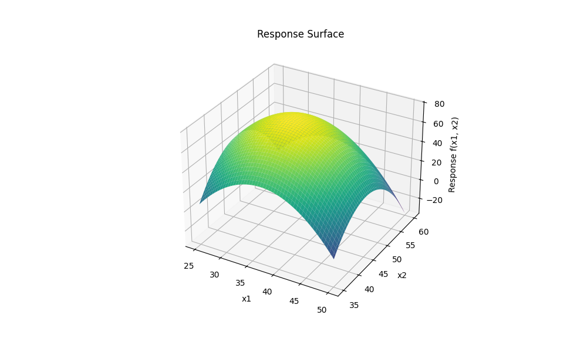
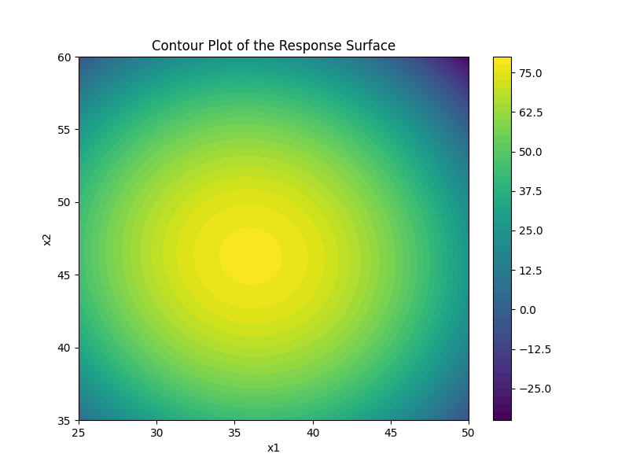

# ATO Simulation and Optimization Framework

## Overview
This repository provides a simulation and optimization framework for a stochastic **Assemble-to-Order (ATO)** system. [cite_start]This study optimizes item pricing by incorporating price-demand dependencies, treating the ATO model as a black box that returns revenue given a set of item prices[cite: 14, 15]. [cite_start]The framework uses the **Surface Response Method** to identify the revenue-maximizing pricing strategy[cite: 16].

Key features include:
- **Stochastic demand modeling** for retail (e.g., fashion stores).
- **Surface Response Optimization** to enhance decision-making.
- [cite_start]**In-Sample Stability Monitoring** to ensure reliable simulation results[cite: 19].

The framework is designed to optimize product configurations, manufacturing processes, and pricing strategies.

---

## Methodology

The optimization process is based on three core components:

### 1. Assemble-to-Order (ATO) Model
[cite_start]The ATO system assembles products from components only after a customer places an order, reducing inventory costs[cite: 22, 23]. [cite_start]In our stochastic model, demand is influenced by price, and the objective is to find the pricing strategy that maximizes revenue based on simulated demand scenarios[cite: 24, 25]. The core optimization problem is formulated as:
[cite_start]$max_{x\in\mathbb{R}^{\prime},y(\omega)\in\mathbb{R}^{J}}-\sum_{i\in T}C_{i}x_{i}+\mathbb{E}[\sum_{j\in J}P_{j}y_{j}(\omega)]$ [cite: 27]

### 2. Surface Response Method
[cite_start]This technique is used to model and optimize the relationship between item prices and expected revenue[cite: 43]. [cite_start]By fitting a polynomial regression metamodel to the revenue data obtained from simulations, we can efficiently navigate the price space to find the optimal configuration that maximizes revenue[cite: 45, 107, 108].

### 3. In-Sample Stability
[cite_start]To ensure the reliability of our revenue estimates, we perform an in-sample stability analysis[cite: 48]. [cite_start]The number of demand scenarios is iteratively increased until the revenue estimates converge within a predefined confidence interval, balancing computational cost with statistical reliability[cite: 49, 152]. [cite_start]The stopping condition is met when the confidence interval for the stability measure contains zero[cite: 138, 142].

---

## Key Results

The methodology was first applied to a two-product case to allow for visualization of the revenue response surface.

|  |  |
|:-------------------------------------------:|:------------------------------------------:|
| *Figure 1: 3D visualization of the revenue response surface.* | *Figure 2: Contour plot showing optimal price regions.* |

The impact of the number of scenarios on the stability of the results was evaluated. The table below summarizes the outcomes for the two-product case.

| Scenario | $R^{2}$ Score | Best Prices | Optimized Revenue |
|:--------:|:-------------:|:-----------:|:-----------------:|
| 100      | 0.9033        | [36, 47]    | 80.6837           |
| 200      | 0.9103        | [36, 46]    | 80.7433           |
| 500      | 0.9113        | [34, 45]    | 79.4134           |
| 1180     | 0.9112        | [34, 45]    | 79.3393           |

[cite_start]The analysis was successfully extended to a three-product case, confirming the model's scalability[cite: 178].

---

## Code Structure

The codebase consists of the following key components:

### 1. Store and FashionStore Classes (`instances/store.py`)
- `Store`: Abstract base class for defining retail stores.
- `FashionStore`: A subclass modeling a fashion retail store, including demand simulation based on pricing.

### 2. ATO Solver (`solvers/ato_solver.py`)
- Implements the ATO model as a black box.
- Returns the revenue given a set of prices.

### 3. Surface Response Optimization (`solvers/surface_response.py`)
- Implements response surface methodology (RSM) to find optimal configurations.
- Uses polynomial regression for meta-modeling.
- Includes visualization tools for response surface analysis.

### 4. Stability Monitor (`main_stability.py`)
- Ensures simulation stability using confidence intervals.
- Iteratively adjusts scenario count to guarantee robust estimates.

---

## Execution Instructions

The main method for optimizing the surface response is `optimize()`, which takes as input a simulation function. In our implementation, this function corresponds to the `run_simulation` method of the ATO class. The optimize method returns the optimal prices along with the corresponding revenue. Additionally, the class provides a visualization method, but it is only available for cases involving two price variables.

Within the ATO class, you can register and set different objective functions using the `register_objective` and `set_objective` methods. The class initializes with a default objective function, which is set during instantiation. Moreover, you can add or remove variables and constraints in the built-in Gurobi model. The `set_n_scenarios` method allows for dynamically adjusting the number of scenarios, which is particularly useful when performing stability checks.

Stability is assessed through the `StabilityMonitor` class, which is integrated into the Surface Response Optimizer following the Observer-Observed programming paradigm.

The abstract `Store` class serves as a repository for all business-related information, including parameters stored in JSON files and demand-related data. Our specific implementation is a `FashionStore`, which provides specialized methods for handling demand distributions. The class initializes with a default demand distribution, but additional distributions can be registered and set using the `register_demand` and `set_demand` methods. Furthermore, you can register demand distributions based on predefined scenarios and their corresponding probabilities.